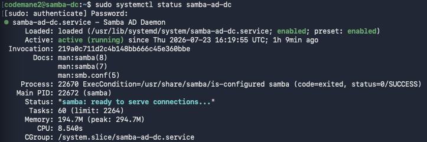
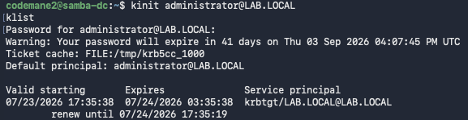
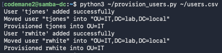
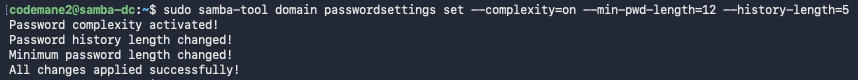
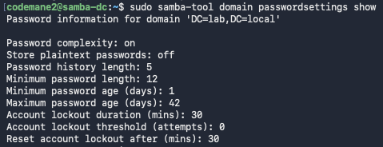

# IAM / Active Directory Case Study

## What this demonstrates

End-to-end Active Directory identity administration — domain provisioning, OU structure, bulk user creation, group-based delegation, and a least-privilege access control model — implemented on a self-hosted Samba4 domain controller, with a physically separate Windows 10 machine joined to the same network as a real domain client.

## Environment

- **Domain controller:** Samba4 on Ubuntu Server, running as a VM on the MacBook Air (dual-homed — one adapter bridged to the real LAN, one on the isolated HomeLab network used by the other lab VMs)
- **Domain:** `LAB.LOCAL`
- **Domain client:** Windows 10 Pro, bare-metal on a Mac Mini, domain-joined and confirmed via `CsPartOfDomain: True`
- **Why Samba4 instead of Windows Server:** a standard x86 Windows Server ISO runs painfully slow through emulation on Apple Silicon. Samba4 implements real AD Domain Services natively, at full speed, with the same OU/group/delegation concepts — see the note on the bare-metal Windows Server attempt below for the full story of why this was the right call for this hardware.

## Process

### 1. Provision the domain

```bash
sudo apt install -y samba krb5-config winbind smbclient samba-ad-provision samba-dsdb-modules samba-vfs-modules acl krb5-user
sudo mv /etc/samba/smb.conf /etc/samba/smb.conf.orig
sudo samba-tool domain provision --use-rfc2307 --interactive
```

Provisioning creates the AD database, Kerberos KDC configuration, and DNS zone from scratch. Realm `LAB.LOCAL`, domain `LAB`, role `dc`, DNS backend `SAMBA_INTERNAL`.

### 2. Switch from file-server mode to full domain controller mode

Ubuntu's base `samba` package only provides the file-server role (smbd/nmbd/winbind). The AD DC role is a separate service:

```bash
sudo apt install -y samba-ad-dc
sudo systemctl stop smbd nmbd winbind
sudo systemctl disable smbd nmbd winbind
sudo systemctl unmask samba-ad-dc
sudo systemctl enable --now samba-ad-dc
```

### 3. Point the machine's own DNS resolution at itself

Samba's internal DNS server needs to actually be queried for domain lookups to resolve. `systemd-resolved` holds port 53 by default and needs to be disabled first:

```bash
sudo systemctl disable --now systemd-resolved
sudo rm /etc/resolv.conf
echo "nameserver 127.0.0.1" | sudo tee /etc/resolv.conf
echo "search lab.local" | sudo tee -a /etc/resolv.conf
sudo systemctl restart samba-ad-dc
```

### 4. Verify the domain is genuinely functional

```bash
host -t SRV _ldap._tcp.lab.local
kinit administrator@LAB.LOCAL
klist
```

Confirmed: real SRV record for the LDAP service, valid Kerberos ticket issued for the Administrator principal.

### 5. Build the OU structure and provision users

```bash
sudo samba-tool ou create "OU=IT,DC=lab,DC=local"

for u in jsmith agarcia mchen; do
  sudo samba-tool user create "$u" "TempPass123!" --given-name="$u"
  sudo samba-tool user move "$u" "OU=IT,DC=lab,DC=local"
done
```

### 6. Create a helpdesk group and delegate password-reset rights — scoped, not domain-wide

```bash
sudo samba-tool group add Helpdesk-IT
sudo samba-tool group addmembers Helpdesk-IT jsmith
sudo samba-tool user setexpiry jsmith --days=0
```

Delegation itself is applied as a direct access control entry on the OU, using AD's standard "Reset Password" extended-right GUID, scoped to the Helpdesk-IT group's SID:

```bash
sudo samba-tool dsacl set --objectdn="OU=IT,DC=lab,DC=local" \
  --sddl="(OA;;CR;00299570-246d-11d0-a768-00aa006e0529;;S-1-5-21-714864701-590618205-2929429102-1106)"
```

Verified by reading the ACE directly back off the object:

```bash
sudo samba-tool dsacl get --objectdn="OU=IT,DC=lab,DC=local" | grep -o "(OA;[^)]*1106)"
```

## Key finding

Helpdesk-IT's members can reset passwords for users inside the IT OU — nothing more. They can't create accounts, can't touch other OUs, can't modify group membership outside what's explicitly granted. This is the actual access-control model real IT support tiers are built on: give the helpdesk exactly enough access to do the job, not domain admin by default. The verification step above doesn't just confirm the delegation *appears* to work through a GUI — it reads the raw access control entry directly off the object, which is the same mechanism Windows AD Domain Services uses internally.

## Files in this repo

- `user_list.txt` — output of `samba-tool user list`, showing the three provisioned users alongside built-in accounts
- `helpdesk_members.txt` — confirms jsmith's membership in Helpdesk-IT
- `delegation_ace.txt` — the raw access control entry proving the scoped delegation is in place
- `users.csv` — input data for scripted bulk provisioning (see addendum below)
- `provision_users.py` — the CSV-driven provisioning script
- `screenshots/` — terminal output captures (see below)

## Screenshots








## Infrastructure note: the Windows 10 domain client

A physical Windows 10 Pro machine (a repurposed 2014 Mac Mini, running Windows via Boot Camp) is domain-joined to this same domain — confirmed via `Get-ComputerInfo` returning `CsPartOfDomain: True`, `CsDomain: lab.local` — demonstrating the client side of this setup, not just the server console. Getting Windows running on that hardware at all was its own significant undertaking, documented in full in this portfolio's main lab playbook, including an abandoned bare-metal Windows *Server* attempt and the eventual working Windows 10 + Boot Camp Assistant path. That write-up is kept separate from this repo since it's really its own story about unsupported-hardware troubleshooting — but it's the reason this project's domain-controller work happened on Samba4 rather than Windows Server in the first place.

## What I'd do differently in production

- Use Group Policy (via Samba4's limited GPO support, or a real Windows Server DC in production) to enforce the same least-privilege posture at the client level, not just the directory level.

---

## Addendum: CSV-Driven Provisioning + Domain Password Policy

### What this adds

The original build hardcoded three usernames directly into a shell loop. This upgrade replaces that with data-driven provisioning from a CSV file — directly reusable Python skill from the `log-ioc-parser` project — plus a real, verified domain-wide password policy.

### The provisioning script

```python
import csv
import subprocess
import sys

with open(sys.argv[1]) as f:
    reader = csv.DictReader(f)
    for row in reader:
        subprocess.run([
            "sudo", "samba-tool", "user", "create",
            row["username"], "TempPass123!",
            f"--given-name={row['given_name']}"
        ], check=True)
        subprocess.run([
            "sudo", "samba-tool", "user", "move",
            row["username"], row["ou"]
        ], check=True)
        print(f"Provisioned {row['username']} into {row['ou']}")
```
`csv.DictReader` reads each row keyed by the CSV's header row, so `row["username"]` works regardless of column order. `subprocess.run([...], check=True)` passes the command as a list of separate arguments rather than one concatenated string — the safer approach, since it avoids the shell needing to parse anything, sidestepping a class of injection risk that string-concatenated commands are vulnerable to. `check=True` makes the script stop immediately on any failed `samba-tool` call rather than silently continuing past a broken provisioning step.

### The domain password policy

```bash
sudo samba-tool domain passwordsettings set --complexity=on --min-pwd-length=12 --history-length=5
```
Verified independently, not just trusted from the `set` command's own success message:
```bash
sudo samba-tool domain passwordsettings show
```
Confirmed active: complexity on, 12-character minimum, 5-password history.

### Key finding

Both pieces replace something that only worked at lab-demo scale with something that scales to a real environment: provisioning driven by external data instead of names baked into the script, and a directory-wide policy actually enforced by the domain controller rather than left at defaults. The verification step for the password policy matters for the same reason delegation was verified by reading the raw ACE back in the original project — a settings command reporting success and a setting actually being active are two different claims, and only the second one is real evidence.