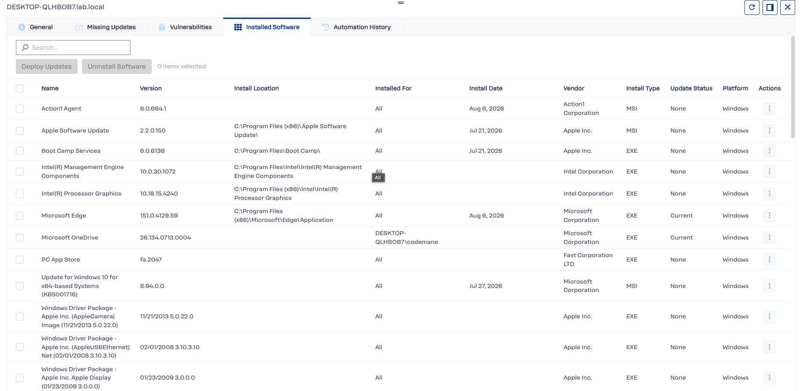
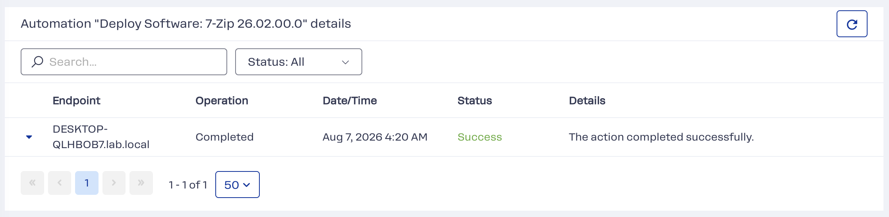
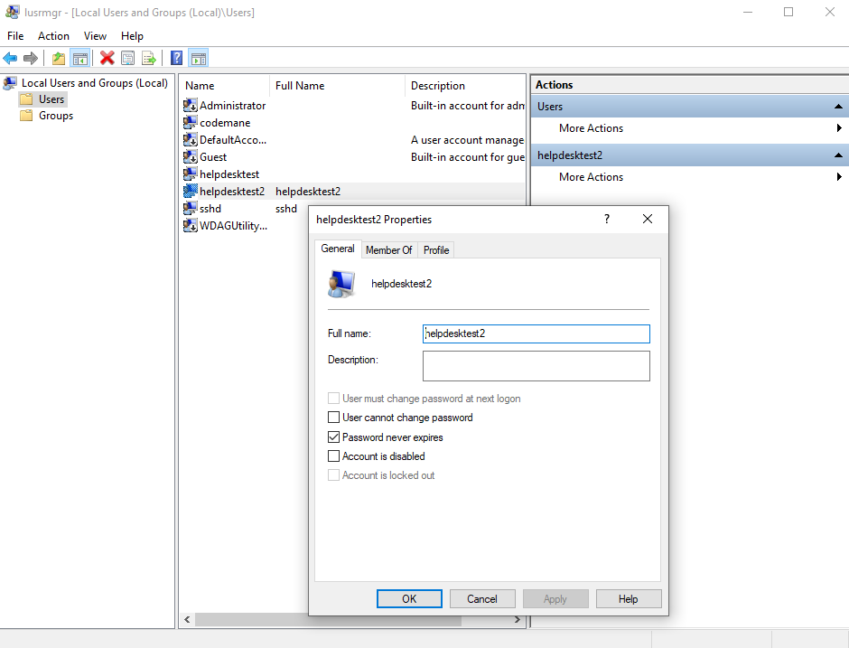
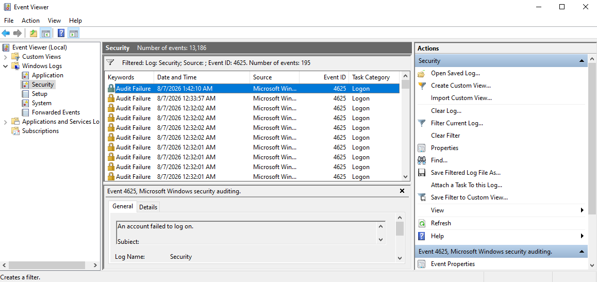
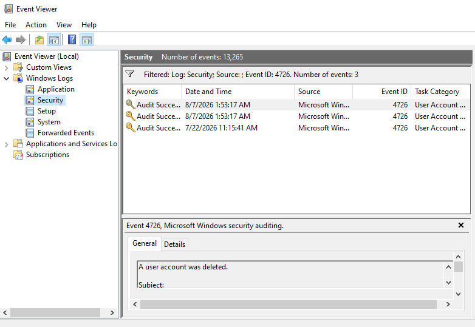

# IAM / Active Directory Case Study

## What this demonstrates

End-to-end Active Directory identity administration — domain provisioning, OU structure, bulk user creation, group-based delegation, and a least-privilege access control model — implemented on a self-hosted Samba4 domain controller, with a physically separate Windows 10 machine joined to the same network as a real domain client.

## Environment

- **Domain controller:** Samba4 on Ubuntu Server, running as a VM on the MacBook Air (dual-homed — one adapter bridged to the real LAN, one on the isolated HomeLab network used by the other lab VMs)
- **Domain:** `LAB.LOCAL`
- **Domain client:** Windows 10 Pro, bare-metal on a Mac Mini, domain-joined — confirmed via `Get-ComputerInfo` returning `CsPartOfDomain: True` and `CsDomain: lab.local`

## Key findings

Five things this project established, each backed by evidence in the sections below.

**Delegation is scoped, and that was verified at the directory level.** Helpdesk-IT's members can reset passwords for users inside the IT OU and nothing more — no account creation, no other OUs, no group membership changes. That is the access-control model real IT support tiers are built on. The verification reads the raw access control entry directly off the object rather than confirming through a GUI, which is the same mechanism AD Domain Services uses internally.

**A command reporting success and a setting being active are two different claims.** This applies to the delegation ACE, to the domain password policy, and to the account lockout — each was read back from the directory after being set. Only the read-back is evidence.

**Two unrelated control planes caught the same attack independently.** A directory-service lockout policy and a log-based SIEM rule both fired on one live brute-force run. Neither depends on the other; either would still catch it alone. That is the substance of defense in depth rather than the label.

**A backup is not proven until a restore is compared against a known prior state.** The restored domain's user list matches a snapshot taken before the simulated failure, and the snapshot is committed so the comparison can be re-run at any time. Equally real: the built-in `samba-tool domain backup` tooling proved the less reliable path here, and establishing that through research rather than working around it blind mattered more than following the original plan.

**Not every capability gap is worth closing.** Extending SIEM monitoring to the Windows client was considered and rejected, because it would have required routing between an attack-simulation segment and the real network. That decision is documented immediately below.

## Governance: a decision not to extend SIEM monitoring to the Windows client

### The decision

Extending the Wazuh SIEM's monitoring to this project's domain-joined Windows client — centralizing its Security Event Log the same way Ubuntu-target's authentication log already is — was considered directly, as a natural next step once both machines were part of the same domain. It doesn't happen, and won't, without a deliberate infrastructure change first: the Wazuh manager runs on Ubuntu-target, which sits on the isolated network segment used for attack simulation; the Windows client sits on the real home network. Connecting the two would mean opening a route between an intentionally hostile, attacker-controlled segment and every other device on the actual production network. That trade was rejected outright — a real gap in log centralization was accepted rather than exchanged for a materially worse one.

### Why this counts as governance, not just infrastructure

Everywhere else in this portfolio, the work is technical: a rule is written, a policy is configured, a system is provisioned. This is different — no tool was built, no rule was written. A risk was identified, weighed against the benefit it would have unlocked, and the lab's own segmentation boundary was chosen over a feature. That's a small-scale but genuine version of what governance actually is: not every capability gap is worth closing at any cost, and stating that tradeoff plainly, in writing, is itself the deliverable — not a placeholder for one.

### What this doesn't claim

This isn't a claim to have built an organizational risk-governance program — a single-operator home lab doesn't have one, and pretending otherwise would undercut the honesty this whole portfolio is built on. It's one real decision, documented plainly, because it's the one artifact this lab's actual scale produced.

## Process

Each step below is what was actually run, in order. Two of them turned up behaviour worth knowing about; the rest is straightforward.

### 1. Provision the domain and bring up the DC role

```bash
sudo apt install -y samba krb5-config winbind smbclient samba-ad-provision samba-dsdb-modules samba-vfs-modules acl krb5-user
sudo mv /etc/samba/smb.conf /etc/samba/smb.conf.orig
sudo samba-tool domain provision --use-rfc2307 --interactive
```

Provisioning creates the AD database, Kerberos KDC configuration, and DNS zone from scratch. Realm `LAB.LOCAL`, domain `LAB`, role `dc`, DNS backend `SAMBA_INTERNAL`.

**Ubuntu's base `samba` package does not include the domain controller role.** It provides the file-server role only (smbd/nmbd/winbind). The AD DC service is a separate package, and it ships masked:

```bash
sudo apt install -y samba-ad-dc
sudo systemctl stop smbd nmbd winbind
sudo systemctl disable smbd nmbd winbind
sudo systemctl unmask samba-ad-dc
sudo systemctl enable --now samba-ad-dc
```

**`systemd-resolved` holds port 53**, so Samba's internal DNS cannot answer domain lookups until it is disabled and the machine resolves against itself:

```bash
sudo systemctl disable --now systemd-resolved
sudo rm /etc/resolv.conf
echo "nameserver 127.0.0.1" | sudo tee /etc/resolv.conf
echo "search lab.local" | sudo tee -a /etc/resolv.conf
sudo systemctl restart samba-ad-dc
```


### 2. Confirm the domain is functional

`host -t SRV _ldap._tcp.lab.local` returns a real SRV record for the LDAP service, and `kinit administrator@LAB.LOCAL` followed by `klist` issues and lists a valid Kerberos ticket.


### 3. Build the OU structure and provision users

```bash
sudo samba-tool ou create "OU=IT,DC=lab,DC=local"

for u in jsmith agarcia mchen; do
  sudo samba-tool user create "$u" "<temp-password>" --given-name="$u"
  sudo samba-tool user move "$u" "OU=IT,DC=lab,DC=local"
done
```

The temporary password is redacted here and in the provisioning script. It was a throwaway value on an isolated lab VM, but publishing a working credential pattern is a habit worth not forming.

### 4. Delegate password-reset rights — scoped, not domain-wide

```bash
sudo samba-tool group add Helpdesk-IT
sudo samba-tool group addmembers Helpdesk-IT jsmith
sudo samba-tool user setexpiry jsmith --days=0
```

Delegation is applied as a direct access control entry on the OU, using AD's standard "Reset Password" extended-right GUID, scoped to the Helpdesk-IT group's SID:

```bash
sudo samba-tool dsacl set --objectdn="OU=IT,DC=lab,DC=local" \
  --sddl="(OA;;CR;00299570-246d-11d0-a768-00aa006e0529;;S-1-5-21-714864701-590618205-2929429102-1106)"
```

Verified by reading the ACE directly back off the object:

```bash
sudo samba-tool dsacl get --objectdn="OU=IT,DC=lab,DC=local" | grep -o "(OA;[^)]*1106)"
```


## Files in this repo

- `user_list.txt` — output of `samba-tool user list`, showing the three provisioned users alongside built-in accounts
- `helpdesk_members.txt` — confirms jsmith's membership in Helpdesk-IT
- `delegation_ace.txt` — the raw access control entry proving the scoped delegation is in place
- `users.csv` — input data for scripted bulk provisioning (see addendum below)
- `provision_users.py` — the CSV-driven provisioning script
- `screenshots/` — terminal and console captures, placed inline throughout this README next to the step each one documents, rather than grouped separately

## What I'd do differently in production

- Use Group Policy (via Samba4's limited GPO support, or a real Windows Server DC in production) to enforce the same least-privilege posture at the client level, not just the directory level.

---

## Addendum: CSV-Driven Provisioning + Domain Password Policy

### What this adds

The original build hardcoded three usernames directly into a shell loop. This upgrade replaces that with data-driven provisioning from a CSV file — directly reusable Python skill from the [`log-ioc-parser`](https://github.com/JSON-MSON/log-ioc-parser) project — plus a real, verified domain-wide password policy.

### The provisioning script

```python
import csv
import os
import subprocess
import sys

TEMP_PASSWORD = os.environ["TEMP_PASSWORD"]

with open(sys.argv[1]) as f:
    reader = csv.DictReader(f)
    for row in reader:
        subprocess.run([
            "sudo", "samba-tool", "user", "create",
            row["username"], TEMP_PASSWORD,
            f"--given-name={row['given_name']}"
        ], check=True)
        subprocess.run([
            "sudo", "samba-tool", "user", "move",
            row["username"], row["ou"]
        ], check=True)
        print(f"Provisioned {row['username']} into {row['ou']}")
```
The temporary password is read from an environment variable rather than hardcoded, so the script can be published without a working credential in it. `csv.DictReader` reads each row keyed by the CSV's header row, so `row["username"]` works regardless of column order. `subprocess.run([...], check=True)` passes the command as a list of separate arguments rather than one concatenated string — the safer approach, since it avoids the shell needing to parse anything, sidestepping a class of injection risk that string-concatenated commands are vulnerable to. `check=True` makes the script stop immediately on any failed `samba-tool` call rather than silently continuing past a broken provisioning step.


### The domain password policy

```bash
sudo samba-tool domain passwordsettings set --complexity=on --min-pwd-length=12 --history-length=5
```


Verified independently, not just trusted from the `set` command's own success message:
```bash
sudo samba-tool domain passwordsettings show
```
Confirmed active: complexity on, 12-character minimum, 5-password history.


## Addendum: Layered Defense — AD Account Lockout + SIEM Correlation

### What this adds

A demonstration that this domain's account lockout policy and the Wazuh SIEM built in this portfolio's SIEM project respond to the same attack independently — two separate control layers, neither aware of nor dependent on the other, rather than a single point of detection dressed up as two.

### Prerequisite: domain-joining Ubuntu-target

Testing this required a real SSH domain login against Ubuntu-target, which wasn't previously domain-integrated — only the Windows 10 client (see infrastructure note above) had ever authenticated against this domain before. Domain-joining Ubuntu-target (winbind, NSS, PAM) was completed first, entirely within the isolated HomeLab segment Samba4's second interface already shares — no change to this lab's network isolation boundary.

That process surfaced a real, previously undetected bug: the original provisioning above (Step 6) ran `samba-tool user setexpiry jsmith --days=0`, intending "never expires" — but `--days=0` actually expires the account at the end of the day it's run, not never. `jsmith`'s account had been silently expired since its creation on July 23, undetected because nothing before this point had attempted a real password-based domain login. Fixed with the correct flag:

```bash
sudo samba-tool user setexpiry jsmith --noexpiry
```

### Steps

```bash
# Domain-wide account lockout policy (Samba4)
sudo samba-tool domain passwordsettings set --account-lockout-threshold=5 --account-lockout-duration=15 --reset-account-lockout-after=15

# Attack (Kali, targeting the now domain-integrated Ubuntu-target)
hydra -t 4 -l jsmith -P /usr/share/wordlists/rockyou.txt ssh://192.168.81.130
```

### Layer 1: directory service response

```
$ sudo samba-tool user show jsmith | grep -i lock
lockoutTime: 134303420349577910
```

A non-zero value confirms the domain genuinely locked the account after 5 failed attempts. The value is an AD timestamp — 100-nanosecond intervals since January 1, 1601 — which decodes to **2026-08-04 18:33:54.957 UTC**. That is 0.6 seconds before the first SIEM alert below, giving the two layers an independently verifiable point of correlation rather than two separate assertions that they both fired.

### Layer 2: SIEM response

Wazuh's rule 100010 (built in this portfolio's SIEM project) fired independently — 23 times against the attacking host, across a 38-second window — reading `auth.log`/`journald` on Ubuntu-target directly, with no dependency on the AD lockout state. (A twenty-fourth alert for the same rule that day came from the hypervisor host address 26 minutes before the attack began, and is excluded from this count.)

```json
{"rule":{"id":"100010","description":"Multiple SSH authentication failures from same source - possible brute force (T1110)","mitre":{"id":["T1110"]}},"data":{"srcip":"192.168.81.128","dstuser":"jsmith"}}
```

## Addendum: Backup & Disaster Recovery Verification

### What this adds

Backup *verification*, not just backup creation — most "I have backups" claims are never actually tested against a real restore. This project simulates a genuine failure and proves recovery with a diff, not just a service that comes back up.

### A recurring infrastructure issue, fixed properly this time

Before backup testing could even start, Samba4 hit the same IPv6-related KDC crash documented earlier in this lab's build (`kdc_add_socket: Failed to bind to <ipv6-address> UDP`) — a third occurrence, despite a prior fix. Root cause this time: the earlier fix only disabled DHCPv6 (`dhcp6: false`), but a separate mechanism — IPv6 Router Advertisements (`accept-ra`) — can independently assign a global IPv6 address via SLAAC regardless of DHCPv6 settings. Disabling both at the netplan level is what actually made the fix durable:

```bash
sudo tee /etc/netplan/00-installer-config.yaml > /dev/null << 'EOF'
network:
  ethernets:
    enp26s0:
      accept-ra: false
      dhcp4: true
      dhcp6: false
    enp2s0:
      accept-ra: false
      dhcp4: true
      dhcp6: false
      match:
        macaddress: 00:0c:29:6f:e9:30
      set-name: enp2s0
  version: 2
EOF
sudo netplan apply
```

### Why `samba-tool domain backup online`/`restore` was abandoned

The built-in Samba backup/restore workflow was attempted first, per the original plan, and hit three separate real issues in sequence: a CLDAP self-discovery failure during backup (resolved by targeting the DC's actual IP instead of `localhost`); an upstream-acknowledged Samba limitation preventing a restore from using the same DC name already present in the backup snapshot ([samba mailing list, February 2019](https://lists.samba.org/archive/samba/2019-February/221019.html): the restore adds the new DC to the database before removing the old entries, so a DC with the same name cannot be added because it already exists); and finally an unresolved internal `"Samba failed to prime database, error code 22"` failure with no public documentation matching this exact scenario. Rather than keep chasing an increasingly obscure, apparently fragile code path, the approach was switched to a simpler, well-established method: a plain file-level backup of the AD database directory. This is itself a real, defensible engineering call — recognizing when a "supported" tool isn't reliable enough to depend on, and falling back to a more transparent method rather than staying wedded to one command.

### Steps

```bash
# Record pre-failure state
sudo samba-tool user list > pre_failure_state.txt

# Backup: stop briefly for a consistent copy, archive, restart
sudo systemctl stop samba-ad-dc
sudo tar -czvf ~/samba-private-backup.tar.gz -C /var/lib/samba private
sudo systemctl start samba-ad-dc

# Simulate failure — rename the live database out of the way, not delete
sudo systemctl stop samba-ad-dc
sudo mv /var/lib/samba/private /var/lib/samba/private.simulated-failure

# Restore from the archive
sudo mkdir /var/lib/samba/private
sudo tar -xzvf ~/samba-private-backup.tar.gz -C /var/lib/samba
sudo systemctl start samba-ad-dc

# Verify
sudo samba-tool user list > post_restore_state.txt
diff pre_failure_state.txt post_restore_state.txt
```

### Verification

```bash
diff <(sort pre_failure_state.txt) <(sudo samba-tool user list | sort)
```

Empty output. The restored domain's user list is identical to the pre-failure snapshot: `tjones`, `mchen`, `Guest`, `krbtgt`, `Administrator`, `jsmith`, `rwhite`, `agarcia`. The snapshot file is committed to this repo, so the comparison can be re-run against the live domain at any time rather than resting on a check captured once.

## Addendum: Real RMM, Local Windows IAM, and Security Log Review

### What this adds

Real Action1 RMM enrollment and endpoint management, local Windows identity administration through both the command line and the GUI, and live security log review — extending this project's identity-administration focus onto the domain-joined Windows client itself, not just the directory service side.

### Action1 RMM — real enrollment, inventory, and a scripted deployment

The Windows Mini stays offline by default; this needed the same brief, deliberate connection window already used elsewhere in this lab. The Action1 agent installs silently over PowerShell, same pattern as any other Windows agent install:

```powershell
Invoke-WebRequest -Uri "<org-specific-agent-url>" -OutFile $env:tmp\action1-agent.msi
msiexec.exe /i $env:tmp\action1-agent.msi /qn
```

Enrollment confirmed both locally (`Get-Service` shows the real internal service name, `A1Agent`, running — not "Action1," the display name) and in the console (endpoint listed as `Connected`, with genuine hardware/OS detail).

Two distinct actions were run to demonstrate two distinct RMM competencies — visibility versus deployment:

- **Software inventory** — collected automatically in real time by the agent, no manual scan step exists. Screenshot shows genuine installed-software data (Boot Camp Services, Apple Software Update, Intel drivers) pulled directly off this actual machine.



- **Scripted deployment** — 7-Zip pushed remotely via the console's Deploy Software action. First attempt failed with a real, specific error: `"The endpoint has not completed the automation within 1 minute(s)."` — not an install failure, a misconfigured automation timeout, confirmed against Action1's own documentation of the "completion deadline" setting. Corrected to a realistic window and re-run; deployment succeeded and 7-Zip appeared in the software inventory with real version/vendor data. Uninstalled afterward via the same console to leave the endpoint in its original state.



### Local Windows IAM — via both interfaces

The same provisioning task, done once through each interface, to genuinely demonstrate both rather than claim both:

```powershell
New-LocalUser -Name "helpdesktest" -NoPassword
Add-LocalGroupMember -Group "Users" -Member "helpdesktest"
```

A second account, `helpdesktest2`, created identically through `lusrmgr.msc` (Local Users and Groups) at the physical console — the graphical console has no SSH equivalent, and this lab has no second Windows machine from which to use Computer Management's [remote connection](https://learn.microsoft.com/en-us/archive/technet-wiki/4558.computer-management), so this step was done at the machine itself. Both accounts confirmed side-by-side in the same user list.



### Real security events in Event Viewer

A deliberately wrong-password login attempt, followed by locating the resulting entry in Windows Logs → Security:

- **Event ID 4625** ("An account failed to log on") — located and confirmed within seconds of the actual failed attempt.



- **Event ID 4726** ("A user account was deleted") — bonus evidence, captured when both test accounts were removed afterward as cleanup; two fresh entries, timestamps matching the deletion exactly.



### A genuine networking finding: disconnecting Windows properly

Restoring this machine to its offline-by-default posture afterward turned into real troubleshooting in its own right. The standard `Set-NetIPInterface -Dhcp Disabled` / `New-NetIPAddress` / `Set-DnsClientServerAddress` sequence didn't actually cut off internet access — `Test-NetConnection 8.8.8.8` kept succeeding despite DNS being broken, because the machine's default gateway route survived every attempt to remove it. Root cause: a **persistent route**, stored in the registry's persistent-route store and left over from `route -p` at some earlier point. It did not appear in a default `Get-NetRoute` listing, only in the classic `route print` output under Persistent Routes — which explained why the gateway kept reappearing no matter what was tried at the address level in between.

```powershell
route delete 0.0.0.0 mask 0.0.0.0 192.168.1.254
```

is what actually cleared it. The persistent store is reachable from PowerShell too — [`Remove-NetRoute`](https://learn.microsoft.com/en-us/powershell/module/nettcpip/remove-netroute) accepts a `-PolicyStore` parameter — so the failure here was querying the wrong store by default, not a missing capability. Confirmed fully offline afterward: `Test-NetConnection 8.8.8.8` returning `PingSucceeded: False`, no route, no source address, while SSH on the local subnet remained fully reachable.

